<!--
  PROFILE README for github.com/MohamedMaged9258 (repo named after the username
  so GitHub renders it on the profile).
-->

## Mohamed Maged

**AI Engineering Student · Flutter Developer · Home-Lab Tinkerer**

 

<!-- animated contribution graph, refreshed daily by the workflow -->

